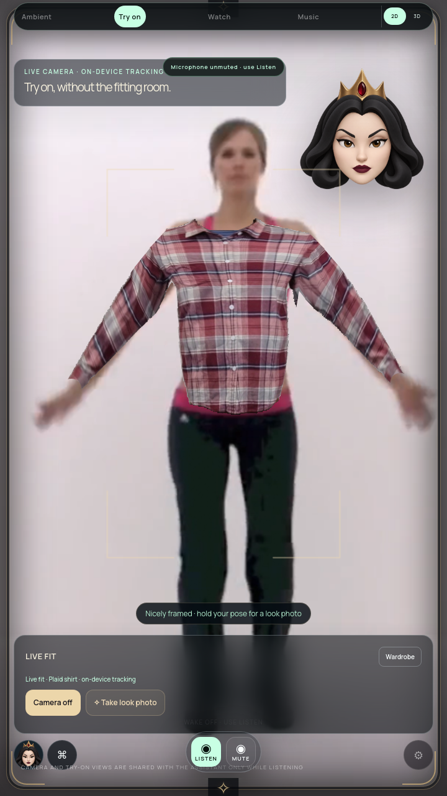

# AR controls and camera diagnostic

Status: checkpoint verified; full-suite goal remains active.

## Changes

The live view opens with a compact bar containing garment status, Camera on/off,
Take look photo and Wardrobe. The drawer contains the existing closet, upload,
effects, fit and optional provider controls. Pointer controls, “open the wardrobe” /
“hide wardrobe,” and interpreted up/down swipes open/close it. Left/right still
change clothes. Editor gestures retain ownership. Leaving AR closes the drawer.
The quick camera button uses the existing camera lifecycle.

## Verification

- `npm test`: passed after adding the missing DOM fixture for quick camera state.
- `tools/check-wardrobe-ui.cjs`: packaged runtime passed at 540×960, 720×1280,
  1080×1920. Closed controls occupy less than 22% of screen height. Drawer pointer,
  interpreted voice/gestures, mode retention and exit checked. Quick Camera off
  ends capture tracks; Camera on restarts capture. Eight saved garments, original
  bytes, front/back editing, phone upload, editor captions and persistence passed.
- Package SHA-256: `8df1e89f8925a3d0dfbf3bbaa2d481836e98f770b4abde2049d5a3647bbc8de5`.

## Camera ghosting investigation

Three decoded source samples match production camera projection exactly, with
opaque output. The requested 12-second seek clamps to the 10.01-second fixture
end; the saved report records actual decoded time. Twelve observed transfers
through the real pose/segmentation worker preserve pixels and match the camera
draw exactly. A frozen actual packaged camera layer differs from an independently
projected retained frame by at most one channel value, with no transparent pixels.
The saved screenshot does not reproduce the earlier strong ghost silhouettes.

These observations do **not** establish the cause or resolve ghosting. Pixel
readbacks change GPU timing; the sample coverage is limited and clarity was off.
Real-time reuse, clarity, accelerated composition and physical camera capture
still need investigation. Layer-removal captures are cumulative; removing the AR
effect canvas does not remove the separate garment canvas.

Reproductions: `tools/check-camera-source.cjs` and
`tools/check-camera-roundtrip.cjs` run with Electron; `tools/check-camera-layers.cjs`
runs with Node against the packaged app under Xvfb. They require the recorded
source and garment fixtures already present in this workspace. Results:
[camera diagnostics](AR-CAMERA-DIAGNOSTICS-2026-10-09.json).

The footage, camera stream, recognized commands and gestures are fixtures. These
checks do not qualify physical sensors, voice recognition, realistic cloth, TV
readability or Windows performance. The pictured garment still looks flat and
exposes some underlying shirt; those visual gates remain open.
