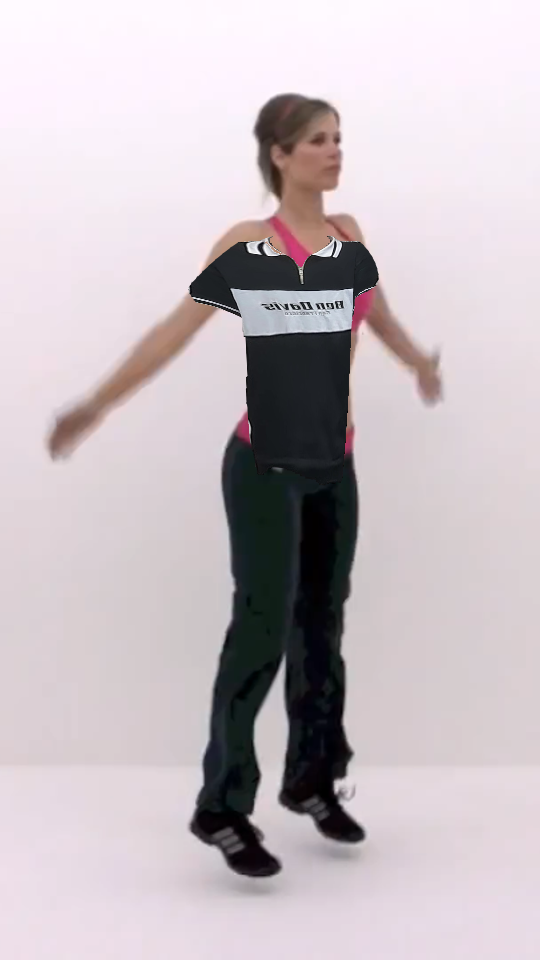

# Camera format and loss ownership

Body tracking now owns source dimensions and availability alongside the stream. A same-stream format change, stopped feed or unavailable video immediately rejects old pose/world/mask/image snapshots. Updating retires the old bitmap and filter state before considering busy inference; late capture/worker results cannot restore the old format. The next valid format can resume without restarting the worker.

The garment overlay now calls tracker invalidation on camera loss, releasing the retained analyzed image and body data as it clears its layer. No extra model, pixel pass, worker or draw loop is added. Cadence limits remain Eco 10 / Balanced 15 / HD 30 submissions per second; actual inference may run slower.

## Verification

The previous frozen package fails a real Electron canvas-stream resize: old pose, world pose and image remain readable after landscape changes to portrait. Final package rejects them before update, closes the old bitmap, and recovers a matching 720×1280 packet; stopping the stream also rejects data and closes its bitmap. Both phases detected a body through the actual offline tracker.

Full tests pass. Recorded-motion regression observes 563 visible garment ticks out of 607 display ticks, plus body-loss clearing and camera-off image/pose/mask release. Review below still shows approximate sleeves/side fit; this is lifecycle evidence and does not meet the fabric realism gate. [Exact archive, source hashes, baseline and reports](BODY-SOURCE-VERIFICATION.json).

Initial probe runs failed while hashing the archive through Electron’s virtual ASAR filesystem. Its automatic window-close also obscured the first error. The probe now waits for cleanup, reports incomplete exit/renderer failure, bounds total execution and reads raw archive bytes. These attempts are excluded from passing evidence.

Physical camera renegotiation, sensors, Windows, sizing/drape and device power remain unqualified. The running NVIDIA soak retains the previous archive; all acceptance gates remain open.
