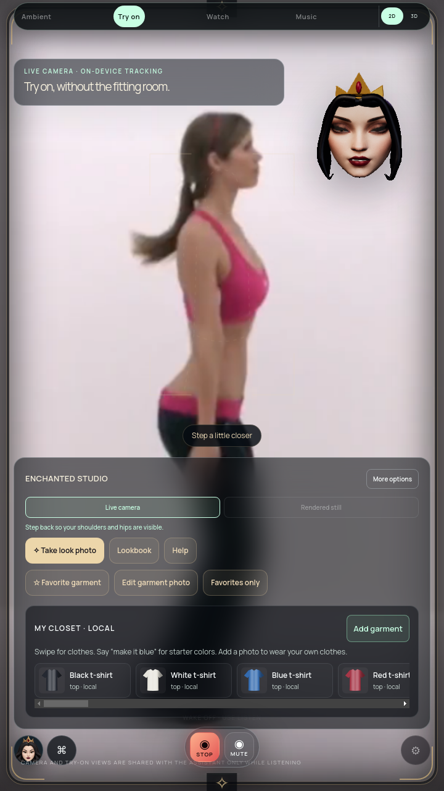

# Combined workload and audio ownership — October 9, 2026

Full suite incomplete. G1/G7 receive stronger local lifecycle evidence; active efficiency and physical inputs remain open.

## Findings and implementation

The packaged baseline silenced the waveform on Stop and hard mute, but retained the TalkingHead worklet, running audio context and hidden animation loop. The combined camera/AR/PCM experiment exposed this directly. Model loading also queued an unused startup `resume`, which defeated an initial suspension attempt. A prototype-level call trace saved the actual `showAvatar → start → resume` stack; the first startup-idle assertion failed and was retained.

`AvatarController` now suppresses the hidden player's automatic start during model loading. Successful owned audio setup starts its animation; initial startup, failed setup, Stop and hard mute disconnect the worklet, retire its message port, remove the output analyser, stop the hidden animation loop and explicitly suspend its audio context. Active barge-in still interrupts queued speech through the existing route. Separate session shutdown uses `stopAudioStream`; subsequent valid audio setup resumes normally. New setup requests are serialized, deduplicated and generation-checked so Stop during an asynchronous load cannot publish a stale player or overwrite the next session.

`GeminiLiveAdapter.stopPlayback` reaches this resource shutdown. Visible FaceHost/RigFaceHost continue to own acting and waveform mouth motion. Camera/AR continue after voice Stop/mute; turning camera off stops further body inference and clears the garment.

## Final evidence

Final Linux archive: `115073b8520be99f9215c245511cd98978042b3268b95c82aba4b6f07cb818b8`. Both changed production modules were extracted and compared byte-for-byte with the source. Exact source hashes are in [structured verification](COMBINED-AUDIO-VERIFICATION.json); Git HEAD at test time was parent `b600c18`, with the audited edits not yet committed.

- Full `npm test`, `npm run pack`: exit 0.
- New unit cases cover duplicate starts, delayed worklet setup interrupted by Stop, immediate restart serialized behind the cancelled setup, retired ports, suspended clocks/hidden animation and injected analyser failure with recovery. A first unit verifier assumed too few microtasks; its scheduling was corrected without weakening lifecycle assertions.
- Final `tools/check-combined-workload.cjs`: all eight packaged phases pass. Initial idle after interaction is suspended. Portrait Stop and rig hard mute leave no worklet/hidden animation and a suspended context; a later rig stream speaks. Camera shutdown produces no further body packets, and sleep submits zero scene/avatar frames. Renderer exceptions: zero. The owned idle-sleep deadline is accelerated from 180 s to 1.5 s; ordinary three-minute scheduling is not requalified by this check.
- Three worklet and three fallback queued-PCM checks pass on the same final archive: silence before output, output-driven onset, gap closure, audible queued tails, visible jaw motion, interruption and restarting across routes. Worklet silence is now proved by a suspended output context; fallback output contexts close. Waveform tests do not prove phoneme accuracy or physical speaker latency.

## Indicative combined cost

720×1280 DPR 1, software graphics, real bundled face/body workers, local long-shirt AR, recorded human video decoded from 1920×1080 and resampled into a 1280×720 synthetic camera stream requesting 30 Hz. Gestures disabled; speech is local synthetic PCM. CPU 100% means one core. Each phase samples approximately eight seconds after settling.

| Phase | Process-tree CPU | Heartbeat lag p95 | Scene/avatar submissions |
| --- | ---: | ---: | ---: |
| portrait-camera-ar-idle | 223.4% | 58.0 ms | 192 |
| portrait-camera-ar-speech | 267.5% | 39.5 ms | 198 |
| portrait-camera-ar-stopped | 219.5% | 68.3 ms | 190 |
| rig-camera-ar-idle | 258.1% | 65.3 ms | 179 |
| rig-camera-ar-speech | 416.1% | 63.8 ms | 170 |
| rig-camera-ar-muted | 262.7% | 64.0 ms | 177 |
| rig-camera-off-muted | 74.6% | 3.0 ms | 239 |
| sleep-muted | 12.3% | 0.3 ms | 0 |

These are shared-host observations, not controlled speedup measurements or physical display FPS. Video decoding/resampling and injected heartbeat/RAF/CDP work contribute to CPU, including during sleep. Summed RSS can double-count shared pages. A positive crash-free result does not satisfy active efficiency: the speaking rig still consumes about 4.2 cores and submits roughly 21 scene/avatar frames per second in this software fixture. GPU acceleration and the intended PC stick must be measured separately.

Baseline seven completed phase observations are retained. Its final sleep verifier timed out because it waited 60 seconds for the real 180-second deadline; that run is explicitly failed, not a passing baseline. Intermediate startup-idle failures are recorded alongside the actual trace and the final passing exact archive.

The image also leaves visual work open: flat garment projection, displayed recorded-image ghosting whose cause is not yet diagnosed, and the tall tools panel covering much of the lower body. No original decoded-frame comparison was completed here. No claim that physical cameras have the same defect or that source enhancement fixes it.

## Reproduce and continue

`xvfb-run -a node tools/check-combined-workload.cjs` uses a copied immutable package, temporary profile, blank provider keys, actual workers and explicit recorded-camera/local-tone fixtures. It needs the existing local author video and plaid garment research files. `MIRROR_PLAYBACK_REPEATS=3 xvfb-run -a node tools/check-playback-sync.cjs` checks six queued playback routes. Raw outputs remain in ignored `artifacts/combined-workload-final` and `artifacts/audio-resource-playback`.

Next: compare accelerated combined workloads and isolate tracking/compositor/rig costs; audit music/watch interruption and restoration, diagnose camera composition against decoded source frames, and reduce control obstruction in live try-on. Broader garment realism, avatar anatomy/consonants, account/phone integrations and final Windows hardware gates remain open. Prior immutable monitors are separate camera/cloud/media-off cohorts.
