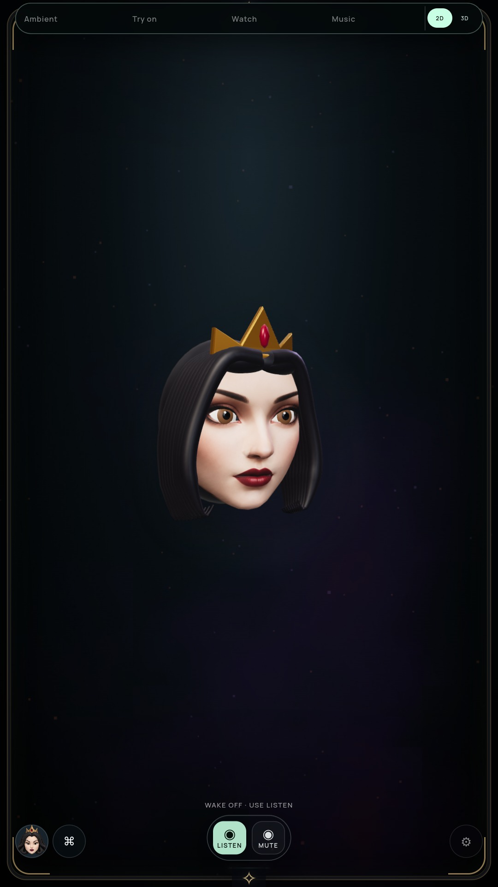

# Crown volume and fit

Status: optional Queen 3D preview improved; full-suite goal and G2 remain open.

## Change

The shallow front extrusion and detached circular band are replaced by a closed
elliptical crown shell around the head. Front, side and rear points share the same
profile and radial thickness. Separate wall/rim normals and a welded-position
back seam retain volume during turns. Small rounded tubes finish the top and base;
a gold bezel seats the existing ruby. The jewel has a less metallic material.

All gold shell/rim/bezel geometry is batched into one static mesh. QueenCrown
contains that mesh and the ruby. Snow's accessories are unchanged.

| Previous right turn | Current right turn |
| --- | --- |
|  |  |

[Current neutral](media/crown-after-neutral.jpg),
[current left turn](media/crown-after-left-30.jpg),
[uninterrupted Queen motion](media/crown-motion.webm).

Reviewed ±30° views preserve a curved side silhouette, thickness and a seated
setting. This remains stylized procedural geometry. Hair parting/locks, crown
ornament detail, portrait likeness and complete facial realism remain open.

## Verification and cost

- Full `npm test` passed.
- Closed shell test welds surface coordinates and requires exactly two triangle
  owners for every edge; duplicate rear positions/normals agree. Coordinates and
  normals are finite. The shell has rear volume and a fixed 96-segment budget.
- Actual persona tests require exactly two crown meshes, valid merged UVs and
  fewer than 5,000 metal vertices. Independent face, mouth, lids and existing
  accessories remain covered by the suite.
- Actual packaged NVIDIA and software audits pass 20 Queen poses, Snow full/half
  closure, ±30° turns, gaze, persona switching, bounded surfaces, five face/glow
  anchors, persistence, context loss and Stop. Settled repaint remains zero.
- NVIDIA motion capture records authored blink/gaze/brow/turn cues continuously;
  full closure and renderer submissions are asserted. No acoustic speech or
  physical-display throughput is qualified by the clip.

In the measured neutral/turn pose, total rig triangles change from 28,812 to 31,008
(+2,196, about 7.6%); draw calls change from 15 to 14. These are actual renderer
counters, not a benchmark or measured power saving. The geometry is constructed
once per persona load and does not add an animation clock, texture or shader pass.

Before source `6976e7a`, archive
`86698337a9be4fa60af080bf51082f3e84af81e5a2305d42f33fe630a60d73d1`.
Current archive
`71c7066dde600d23ff6bd8875c8646de6bce83b1dd03d2c0c23e5888e1439465`.
[NVIDIA verification](CROWN-GPU-VERIFICATION.json),
[software verification](CROWN-SOFTWARE-VERIFICATION.json).

Reproduce with `npm test`, `npm run pack`, and
`MIRROR_RIG_MOTION=true MIRROR_RIG_BACKEND=vulkan xvfb-run -a node tools/check-rig-ui.cjs`.
Omit the graphics environment variable for software rendering.

The prior `2743f98` NVIDIA development monitor finished with 590 samples and zero
recorded errors, camera/cloud/media off. That is old-build lifecycle evidence;
it cannot qualify this crown build or the final combined eight-hour release.
Keep the portrait default while visual and efficiency gates remain open.
