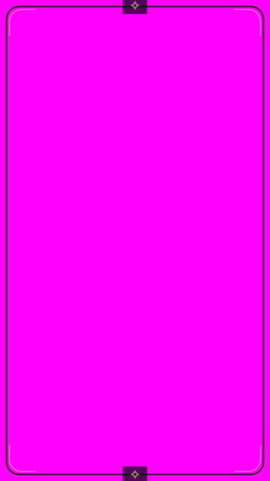
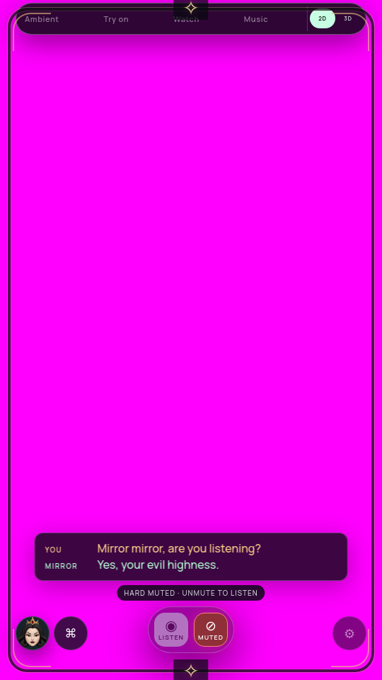

# Voice controls stay readable during the reveal — 2026-10-09

The fog canvas previously shared UI z-index 10 and was appended after it, so its pixels painted over Stop/Listen, mute, captions and status. Fog now uses layer 9 above the awakening background and below the UI. During wake/arrival, status also has a small dark backing with clear text. These are compositing/style changes with no new surface, shader, worker or animation loop.

## Before/after proof

[Saved results and source hashes](CUE-CONTROLS-VERIFICATION.json). Baseline archive `c2629732a0308e8e3f4c3cdbc266e2b73a4ed64e7555d6f5ad974fa36a45eb9c` fails the actual packaged compositing check: at 540×960 and 1080×1920, an opaque diagnostic cue completely covers each of the two buttons, captions and status, despite CSS reporting them visible.

Final archive `463b2f2144cb0843079c32587e80c16bb056de356ad9ab408200882935cd0a45` passes both sizes: zero pure diagnostic-color pixels in each measured element rectangle. The diagnostic intentionally replaces fog pixels with opaque magenta to detect layering; it is not the product appearance. Caption input is supplied through production callbacks, not acoustic recognition.

| Diagnostic before | Diagnostic after |
| --- | --- |
|  |  |

[Actual native appearance](media/cue-controls-native.jpg), [timed native capture](media/cue-controls-native-live.mp4).

## Regression checks

- Actual Chromium clicks on Stop and hard mute during live cues work at both portrait sizes. The native NVIDIA animation checks also confirm cancellation and no continued cue draws, reduced-motion behavior, and no black fog samples/GL error.
- Packaged four-viewport UI audit and full tests pass. Final embedded stylesheet matches the source.
- The live capture uses timed screenshots; export/display FPS, real acoustic wake/greeting/Stop, physical TV contrast and wattage remain unqualified. This does not establish a formal contrast ratio for every possible background.

The camera/AR monitor remains on older frozen source `f9a1291`. All G1–G8 gates remain open.
