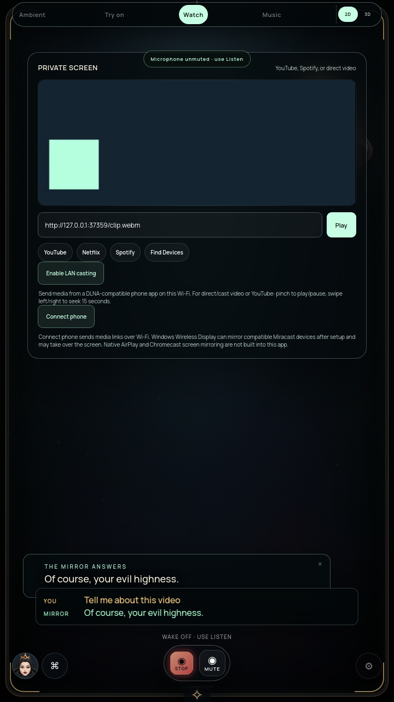

# Accelerated combined workload and watch audio — October 9, 2026

Full suite incomplete. This advances G5/G7 on the current DGX Spark; it does not qualify physical Windows, TV sound, casting interoperability or full power efficiency.

## Local watch behavior

`WatchAudioDucking` temporarily lowers the direct/cast media element to 25% of its chosen volume during conversation. Stop, hard mute or conversation ending restores the prior value only while the policy still owns it. Repeated listening/speaking transitions do not compound attenuation. It changes neither playing/paused state nor the user's media mute.

Native HTML volume changes and explicit phone volume commands override the policy for the rest of that conversation. Explicit cast commands are routed through `setUserVolume`, including a command equal to the already reduced value that would emit no DOM change. Old volume is then not restored. Delayed media load joins an active conversation. Listener cleanup and zero/muted volume are covered. No Web Audio interception is used in production, avoiding CORS-dependent silencing of ordinary media links.

Mirror structural state reports this capability only for direct/cast media. YouTube, arbitrary embeds and native Spotify still need their own supported volume integration. Automatic ducking is not claimed for those sources.

## Exact packaged watch verification

Archive `a2ef6ed3f2f856ac88d072ce092b4572b1699828c255da28bd411c5152573fcf`. Extracted renderer, helper and cast adapter match current source byte-for-byte. [Structured verification](GPU-WATCH-AUDIO-VERIFICATION.json) records their hashes, the parent Git revision, test outcomes, phase metrics and scope. Full `npm test` and `npm run pack` exited 0.

`tools/check-watch-audio.cjs` creates a synthetic VP8/Opus clip, serves and decodes it over local HTTP in the installed app, and samples the decoded media waveform through a test-only observer before a muted sink. Local assistant PCM traverses the actual speech worklet independently. This measures browser audio processing, not sound from physical speakers.

- Initial media volume `.8`, RMS about `.085`; conversation volume `.2`, RMS about `.021`.
- Stop and hard mute restore `.8` and the decoded waveform, while video remains playing and speech ends.
- The actual LAN receiver UI is enabled. Real native RenderingControl SOAP → IPC → cast-player commands preserve a phone's explicit 20% volume even when it equals the policy's reduced value.
- A phone's media mute survives speech Stop, and a paused video stays paused.
- Optional public YouTube check passes in the packaged app: actual IFrame playback continues during synthetic assistant speech and after Stop; paused YouTube remains paused. Structural ducking capability correctly stays unsupported. No signed-in account, DRM, physical sound or YouTube-volume reduction claim.

Initial probe and VM-fixture failures are retained in the structured report. The startup predicate was guarded properly and fixtures supplied the new dependency; final production checks and full tests pass.

The inspected image exposes another open defect: the compact avatar occupies the top-right media-panel region and is partly obscured. Fix placement against actual media, controls and caption bounds; this screenshot is not a visual-quality pass.

## Accelerated combined workload

The harness now supports `MIRROR_COMBINED_GRAPHICS=vulkan` and rejects an accelerated result unless the actual rig backend identifies NVIDIA. Both the original audio checkpoint and this updated watch package passed all eight phases. The current archive uses NVIDIA GB10 through ANGLE Vulkan, physical rig lighting, actual local face/body workers, long-photo AR and local PCM. Requested 720×1280 DPR 1; recorded 1920×1080 video is resampled into a 1280×720 camera transport requesting 30 Hz. Gestures off; no cloud/microphone/live music workload.

| Phase | Process-tree CPU | Scene/avatar submissions | Heartbeat lag p95 |
| --- | ---: | ---: | ---: |
| portrait-camera-ar-idle | 110.4% | 29.9/s | 5.7 ms |
| portrait-camera-ar-speech | 131.8% | 29.5/s | 3.8 ms |
| portrait-camera-ar-stopped | 106.8% | 29.5/s | 4.7 ms |
| rig-camera-ar-idle | 120.7% | 30.0/s | 3.1 ms |
| rig-camera-ar-speech | 136.7% | 29.4/s | 3.1 ms |
| rig-camera-ar-muted | 120.9% | 29.7/s | 1.8 ms |
| rig-camera-off-muted | 15.9% | 29.6/s | 0.4 ms |
| sleep-muted | 6.3% | 0.0/s | 0.3 ms |

CPU 100% represents one core. The latest speaking portrait/rig observations are roughly 1.3/1.4 cores, versus roughly 2.7/4.2 in the prior software cohort. These runs use different source archives and shared-host timing; do not treat the difference as a controlled CPU saving or hardware wattage. About 30 submissions/s and low heartbeat lag demonstrate the accelerated path runs here; submissions are not physical display FPS or input/acoustic latency. Synthetic camera decoding/resampling, observer timers and CDP contribute to process cost. Summed RSS can double-count shared pages.

Current accelerated startup/Stop/mute/restart/camera-off/sleep checks pass. Avatar audio clocks remain suspended and worklets/hidden animation retired outside their owned stream; camera-off stops further body packets, and accelerated idle sleep submits zero scene/avatar frames. The sleep deadline is accelerated for cleanup testing. The separate prior-build camera/cloud/media-off monitors are not final combined release qualification.

## Reproduce and next work

- `MIRROR_COMBINED_GRAPHICS=vulkan MIRROR_COMBINED_LABEL=combined-workload-nvidia-watch-build xvfb-run -a node tools/check-combined-workload.cjs`
- `MIRROR_WATCH_AUDIO_YOUTUBE=true xvfb-run -a node tools/check-watch-audio.cjs` (public YouTube/network needed only for the optional check).

Continue watch avatar placement and control obstruction, decoded-source versus camera-composition diagnosis, and supported YouTube/native Spotify volume restoration. Broad garment realism, avatar anatomy/consonants, gesture/parallax calibration and final Windows/account/phone hardware gates remain open. No goal completion claim.
