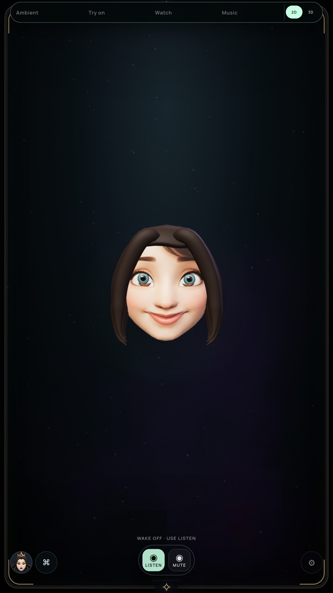

# Rounder upper hair dome — 2026-10-09

The upper root volume had an angular top, especially on Snow. Seven rings used uniform vertical spacing, leaving a broad final fan near the pole. Eleven rings now follow angular latitude spacing along the same curved profile, giving a rounder reviewed silhouette while retaining the hairline/persona contour.

| Before | Final Snow |
| --- | --- |
|  |  |

[Queen](media/hair-dome-after-queen.jpg), [Snow motion](media/hair-dome-snow-motion.webm), [Queen motion](media/hair-dome-queen-motion.webm).

## Experiment decisions

A local fiber bump surface at strengths 0.006 and 0.018 passed renderer checks but made insufficient visible difference in reviewed frames. It was removed; [rejected Snow image](media/hair-fibers-rejected-snow.jpg). An intermediate 16-ring trial had an incorrect triangle-count expectation and was discarded; it would also exceed the hair vertex budget. Intermediate archives are not final evidence.

## Verification and cost

Final archive `ee3c4ad6d9e4c862f1a0594f2ba4114b470f677deaeaba3f8b54abdb921a5c67`; embedded hair sources match current source. [Saved native/software/playback results and source hashes](HAIR-DOME-VERIFICATION.json).

- Native NVIDIA and software audits pass mouth/eye/brow/gaze/turn poses, both personas' continuous acting, five face/glow anchors, quality/reload, iris disposal, Stop and context-loss recovery. Settled repaint remains zero.
- Actual TalkingHead worklet and Web Audio fallback pass queued silence/gap/tail/Stop playback checks with local PCM. Full tests pass.
- Cap: 1,069 vertices / 2,112 triangles; batched hair stays below 6,000 vertices. Added cost: 388 vertices and 768 triangles. Native scene: 24,320 triangles / 14 draws; software adds two compositor draws/triangles. No new texture, material, worker or per-frame geometry update.

These checks do not measure device power or physical-display throughput. Hair remains sculpted; natural speech shapes and the full cinematic experience still need work. The camera/AR monitor freezes the older `f9a1291` archive. All G1–G8 gates and Windows qualification remain open.

The first evidence-saving script used an incorrect Queen clip filename and stopped before writing this narrative/ledger. The existing clip was then copied under its correct name and this follow-up documentation saved; runtime results were unaffected.
