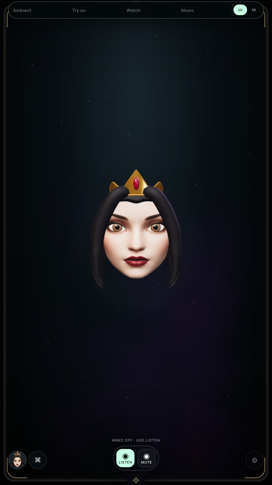

# Curved hair roots and forehead framing

Optional 3D preview checkpoint; G2 and all suite completion gates remain open.

## Change and visual review

The forehead's nearly level upper edge remained visible between the locks. Snow's separated roots exposed a broad patch of the rear scalp. A closed curved root volume now joins the existing hair, with a restrained central widow's peak for the Queen and a gentler side part for Snow.

The first cap projected too far forward and looked like a thick headband. It was rejected. Final depth is reduced and the contour has 96 angular segments to soften the hairline; the added volume is batched into the same static hair mesh and material.

| Before | Final Queen |
| --- | --- |
|  |  |

[Queen side](media/roots-after-side.jpg), [Snow](media/roots-after-snow.jpg), [rejected thick cap](media/roots-rejected.jpg), [Queen continuous motion](media/roots-queen-motion.webm), [Snow continuous motion](media/roots-snow-motion.webm).

## Verification

- Full `npm test` passes on final source. Cap tests check 681 finite vertices, 1,344 triangles, outward front/underside normals and distinct persona contours. Existing welded hair edge/normal checks verify closed topology and the under-6,000-vertex budget after batching.
- Packaged actual NVIDIA/software audits pass explicit expression/turn/blink/gaze poses, authored continuous motion, quality/persona/reload, shared iris disposal, five face/glow anchors, context loss and Stop. Settled repaint remains zero. [NVIDIA](HAIR-ROOTS-GPU-VERIFICATION.json), [software](HAIR-ROOTS-SOFTWARE-VERIFICATION.json).
- NVIDIA changes from 22,208 to 23,552 triangles, retaining 14 draws. Software retains two additional compositor triangles/draws. There is no new material, texture, shader, worker or per-frame geometry update. This is a bounded visual tradeoff, not a measured power saving.
- Both actual PCM playback routes pass silence/gap/tail/Stop regression checks; existing 2.30-second recorded greeting is replayed through the real worklet and saved with the rig canvas. [Playback](HAIR-ROOTS-PLAYBACK-VERIFICATION.json). This does not establish natural phoneme accuracy.

Final archive: `685949026a076067706f4ee342872f495d9a4d65584e6fae5b961ead15c38cc8`. [Source and test hashes](HAIR-ROOTS-BUILD.json).

Reproduce: `npm test`, `npm run pack`, then `MIRROR_IRIS_AUDIT=true MIRROR_RIG_MOTION=true MIRROR_RIG_BACKEND=vulkan xvfb-run -a node tools/check-rig-ui.cjs`. Omit the backend variable for software.

An initial source syntax error was corrected, and a prematurely built archive was rejected after the exact source comparison failed. Final runtime checks use the corrected, matched archive. Surface winding and the boundary-normal test were also corrected before the accepted visual version.

## Remaining work

Hair is still sculpted rather than strand-level or physically simulated. Snow's upper root mass and the locks' smooth surfaces remain visibly stylized. Review broader likeness, hairline surface detail, mouth/interior anatomy and uninterrupted natural speech; retain portrait as default. The enabled-camera monitor remains on the preceding `be0efb1` archive and does not exercise this cap. Physical TV/Windows qualification and the full-suite gates remain open.
