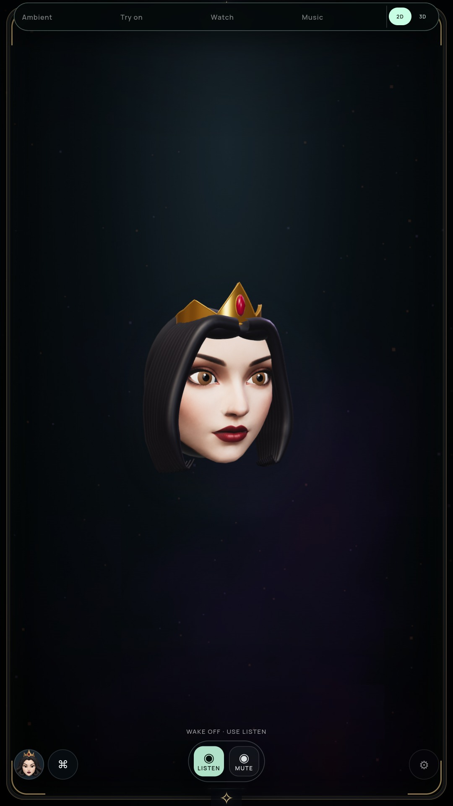
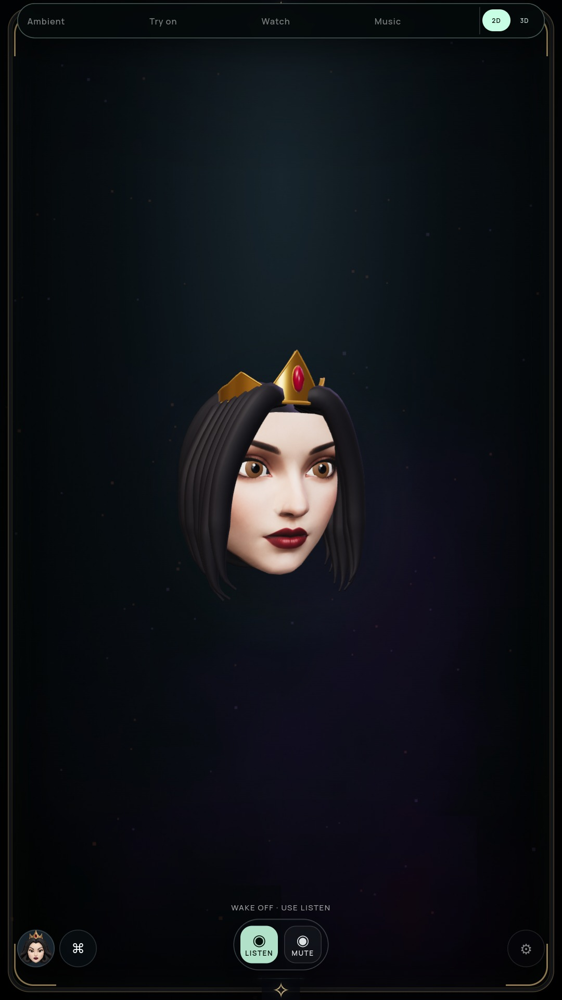

# Hair silhouette, tips and shading seams

Status: optional 3D preview improved; full-suite goal and G2 remain open.

## Review and change

The previous side view used nine similar round tubes per side, matching tips and
two spherical front rolls. The new shape uses six broader, flattened locks per
side, a sweeping part, different front/back lengths and staggered tips. Queen and
Snow have different end lengths. Front roll spheres are removed. Roughness rises
from .48 to .68 to soften the broad plastic highlights.

The first prototype exposed a blocky cut at the centre part; that version was
rejected. Final roots narrow into the upper hair instead. Both ends are capped,
and duplicated radial seam normals now agree after shaping. Geometry and all
hair materials are still batched into the existing single static draw.

| Prior Queen side | Current Queen side |
| --- | --- |
|  |  |

[Current Queen front](media/hair-after-neutral.jpg),
[current Snow](media/hair-after-solenne.jpg),
[rejected root prototype](media/hair-rejected-neutral.jpg).
[Queen motion](media/hair-queen-motion.webm),
[Snow motion](media/hair-solenne-motion.webm).

Reviewed front/side silhouettes lose the row of matching curled ends and harsh
seam stripes. The result remains visibly sculpted, particularly Snow's parting;
this is not strand-level hair, physical hair simulation or full likeness proof.
Further root/hairline and fine surface detail remain open.

## Verification and audit correction

- Full `npm test` passed on final production source.
- Actual persona geometry tests require finite UV/normal/position attributes,
  matching attribute counts and fewer than 6,000 batched hair vertices. Every
  geometrically welded triangle edge has two owners, including the exposed tips.
  Duplicated welded positions have matching normals.
- Packaged NVIDIA/software pose audits pass 20 Queen poses, Snow closure,
  independent lids/gaze, ±30° turns, persona switching, quality/persistence,
  five face/glow anchors, context loss and Stop. Settled repaint remains zero.
- Uninterrupted authored blink/gaze/brow/turn clips assert full closure and actual
  renderer submissions. They do not qualify acoustic speech, camera tracking or
  physical display frame rate.
- The first runtime audit stopped on its old `triangles > 25000` assertion after
  intentional simplification. That lower bound was not a visual acceptance target.
  The final audit instead derives expected triangles/draws from all visible scene
  meshes, includes the two software compositor passes, and requires actual render
  counters to match and stay below a 35,000-triangle bound. Visual
  comparison and topology tests accompany this correction.

Actual NVIDIA neutral/turn geometry changes from 31,008 to 22,208 triangles
(-8,800, about 28.4%), with 14 draws in both. Software has two compositor triangles
and draws in addition. No texture, shader, worker, interval or runtime animation
is added. This is a geometry reduction, not a measured power saving or Windows
PC-stick qualification.

Before source `248e023`, archive
`71c7066dde600d23ff6bd8875c8646de6bce83b1dd03d2c0c23e5888e1439465`.
Final archive
`64fc0aadb8d87a36c74dc1320f4148fea12e8d324c1588188fa36eb509e974f5`.
[NVIDIA verification](HAIR-GPU-VERIFICATION.json),
[software verification](HAIR-SOFTWARE-VERIFICATION.json).

Reproduce: `npm test`, `npm run pack`, then
`MIRROR_RIG_MOTION=true MIRROR_RIG_BACKEND=vulkan xvfb-run -a node tools/check-rig-ui.cjs`.
Omit the graphics environment variable for software rendering.

The live NVIDIA monitor owns the preceding immutable `248e023` crown archive;
it runs camera/cloud/media off. It does not qualify this hair build, active
conversation or the final combined endurance gate. Portrait remains default;
continue live speech/acting, hairline detail, camera/wardrobe realism and Windows
installation proof.
