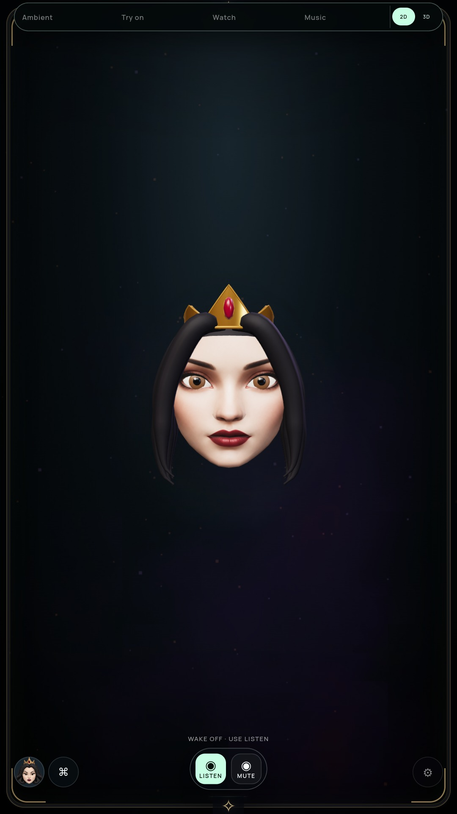
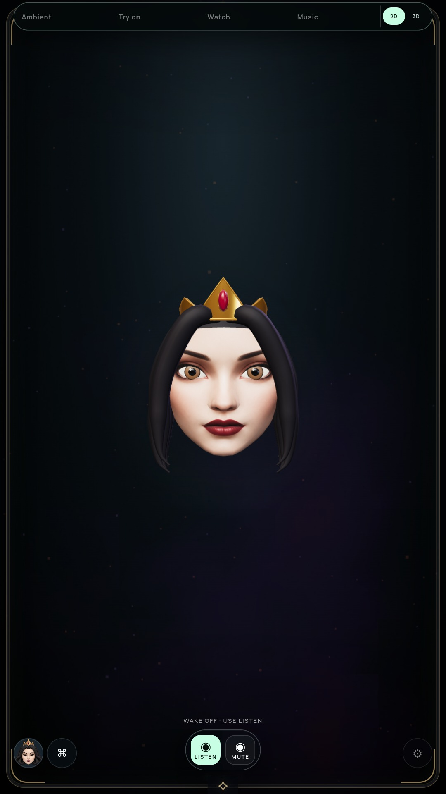

# Local iris detail

Status: optional 3D preview improved; G2 and the full suite remain open.

## Review and change

The old eyes used uniform brown/blue iris spheres with separate pupils and glints. A deterministic 128×128 local map now adds radial fibers, a dark outer rim and subtle inner color variation. Planar front projection avoids the sphere's latitude pattern. Both eyes share one material and texture; gaze, pupils, glints, lids and geometry stay independently controlled as before.

The first prototype was too gold and bright, and was rejected on visual review. Final colors retain the Queen's brown eyes and Snow's blue-green eyes. Texture UVs are clamped because sphere float precision initially produced values just outside [0,1].

| Before | Final Queen |
| --- | --- |
|  |  |

[Final Snow](media/iris-after-solenne.jpg), [Queen motion](media/iris-queen-motion.webm), [Snow motion](media/iris-solenne-motion.webm), [recorded greeting replay](media/iris-queen-speech.webm).

## Verification

- Full `npm test` passes. Geometry checks require finite bounded projection, 128×128 RGBA/sRGB, opaque varied pixels and a shared material/map. Existing 38 expression channels and closed-mouth/eyelid topology remain covered.
- Packaged NVIDIA and software audits cover 20 Queen poses, Snow/full and partial blink, independent gaze, turns, continuous authored motion, quality/reload, five face/glow anchors, context loss and Stop. Live texture checks prove one shared 65,536-byte base map per persona and exactly one disposal on replacement. [NVIDIA result](IRIS-GPU-VERIFICATION.json), [software result](IRIS-SOFTWARE-VERIFICATION.json).
- Existing topology/draw count is retained: NVIDIA 22,208 triangles/14 draws; software 22,210/16 including compositor passes. Settled repaint remains zero. Mipmaps add bounded storage beyond the 64 KiB base. One static texture lookup is added to iris shading; this is not a measured power saving.
- Final archived build `acec6469d55439a54dbdc579a02498cdd68c361da481f633618f77001311192c` passes real TalkingHead worklet and Web Audio fallback silence/gap/tail/Stop checks. The existing 2.30-second greeting is replayed locally with the actual PCM and rig canvas, producing AA/EE/FV/O/OU predictions. [Playback result](IRIS-PLAYBACK-VERIFICATION.json). Prediction diversity is not phoneme accuracy.

[Exact source/test hashes](IRIS-BUILD-2026-10-09.json). [Rejected bright prototype](media/iris-rejected-bright.jpg).

Reproduce: `npm test`, `npm run pack`, then `MIRROR_IRIS_AUDIT=true MIRROR_RIG_MOTION=true MIRROR_RIG_BACKEND=vulkan xvfb-run -a node tools/check-rig-ui.cjs`. Omit the backend variable for software. Speech: `MIRROR_REQUIRE_VISEMES=true MIRROR_CAPTURE_GREETING=true MIRROR_PLAYBACK_GRAPHICS=vulkan xvfb-run -a node tools/check-playback-sync.cjs`.

## Audit limitations

The first retirement assertion incorrectly expected a fallback to an unsupported persona to destroy the cached rig. Actual supported-persona replacement does release it. The assertion was corrected to match that lifecycle. The existing portrait fallback retains the last rig in memory; this checkpoint does not prove it releases all hidden rig resources.

The face and hair remain stylized, and a static iris map does not solve full eye anatomy, hairline realism, natural consonant alignment or physical latency. Motion clips use authored inputs and are not real camera tracking or display frame-rate qualification. The running enabled-camera monitor owns the previous `be0efb1` archive, not this eye-detail build. Portrait remains the default; all master gates remain open.
