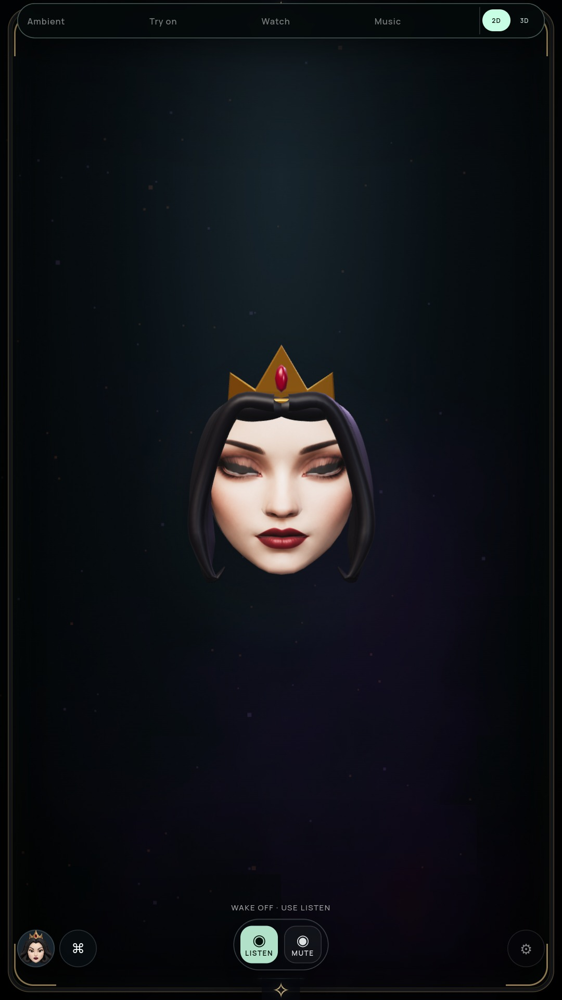
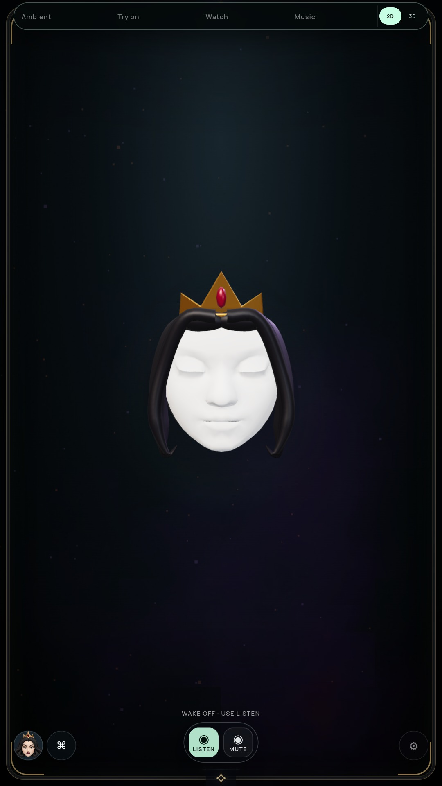

# Eyelid closure and remaining texture defect

Status: geometry corrected and diagnostic narrowed; blink visual gate remains open.

## Geometry correction

Blink previously moved the two lid edges in height while retaining their original
width/depth offsets. Across the actual Queen mesh, corresponding closed edges
differed by up to approximately 0.0274 units horizontally and 0.0173 in depth.
Both edges now converge on the same 3D lash line, retaining the upper/lower motion
ratio and forward clearance from the iris. Neutral vertices remain unchanged.

Geometry tests cover every paired lid vertex on both actual GLBs, with independent
left/right channels. Actual packaged renderer diagnostics confirm both blink
weights reach 1 and central closed-edge differences are below 8e-9 units.

## What the screenshots show

The dark band **survives** this geometry fix. The original proposed explanation
was incomplete. Disabling the portrait map removes the dark band and exposes
closed skin geometry. Subsequently hiding the posterior head and the eyeballs
makes no appreciable difference in this captured closed pose. This points to the
open-eye portrait texture stretching over the closing lid. The next change should
address texture mapping during closure rather than enlarging the geometry.

| Original texture, corrected geometry | Texture disabled for diagnosis |
| --- | --- |
|  |  |

These are cumulative diagnostic removals. The untextured face is not a proposed
customer appearance. Retain the textured neutral likeness and natural lash line
when developing the next fix; avoid a flat painted eyelid or binary eye hiding.

## Runtime verification

- Full `npm test` passed.
- Expanded actual NVIDIA and software audits passed 20 posed expressions/views,
  including half blink, independent closures, closed ±32° turns, wide and squint.
  They verify live edge convergence, persona loading, neutral reuse, eye gaze,
  mouth visibility, quality bounds, persistence and placement anchors.
- Optional `MIRROR_LID_DIAGNOSTIC=true` on `tools/check-rig-ui.cjs` saves original,
  no-map, no-map/no-head and no-map/no-head/no-eyes screenshots and restores state.
- Archive: `afbb2f70a52c9572a8762229ea109bcce9147b3703fe1be9b853616690c8821a`.
- [NVIDIA report](LID-GPU-VERIFICATION-2026-10-09.json) and
  [software report](LID-SOFTWARE-VERIFICATION-2026-10-09.json).

This is renderer/geometry evidence, not proof of visually convincing blinking,
continuous facial acting, physical display performance or tracked human blinks.
The 3D performer stays an optional preview and the full-suite goal stays active.
Existing monitors run older immutable source; this build has no completed soak.
