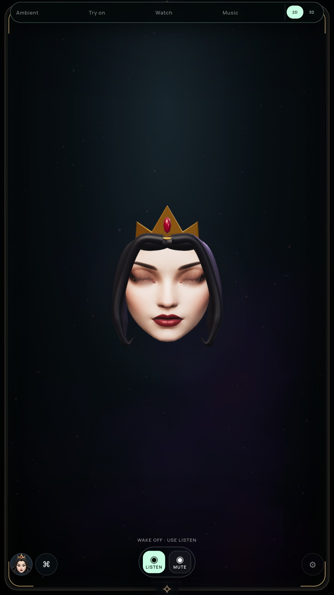
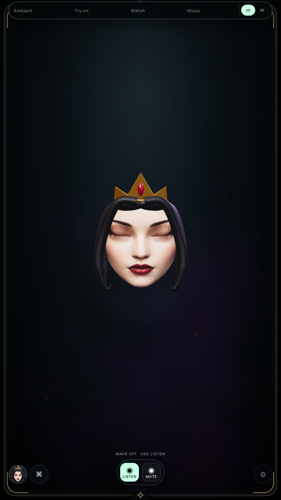
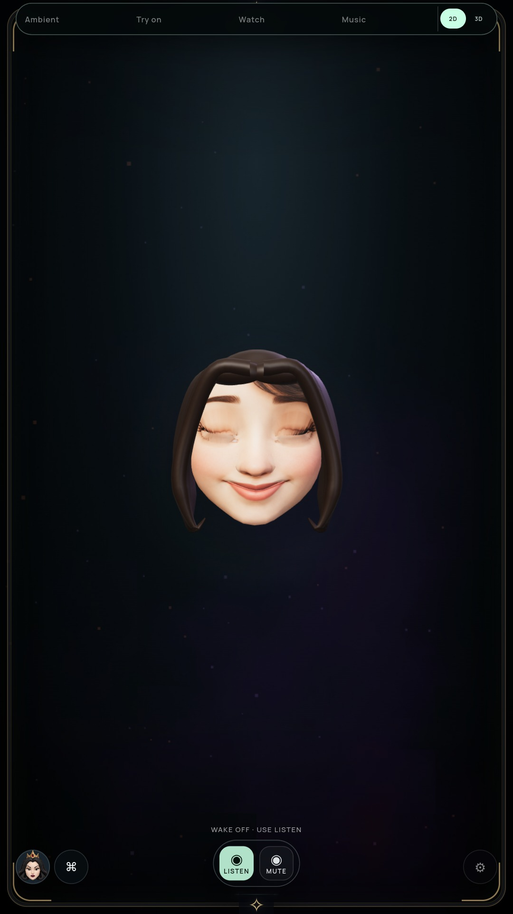

# Continuous lid folds and corner sampling

Status: optional 3D preview improved; G2 and the full-suite goal remain open.

## Evidence-led diagnosis

The previous Snow closure retained a pale corner wedge and a rectangular shaded
band. Moving just the two inner corner UVs did not clear the defect. Increasing
lower-row skin reach reduced the pale wedge but left the band. Hiding the eye
accessories left the band intact; removing the texture still showed a shelf in
the lid surface. These were diagnostic mutations in the actual prior packaged
NVIDIA app, not production fixes or qualified visual passes.

| Prior closure | Current closure |
| --- | --- |
|  |  |
|  |  |

[Prior Snow without eye meshes](media/lid-fold-before-solenne-eyes-hidden-diagnostic.jpg)
and [without the texture](media/lid-fold-before-solenne-no-map-diagnostic.jpg)
isolate the geometry shelf. Prior archive:
`581475de3ef4fb9ffee2ccc558ed1b94a4cfb4832c04f8ad003ef24192c76bb4`.

## Change

Adjacent upper/lower skin now follows 60% of its lash edge deformation in XYZ
for independent blink, squint and wide channels. Existing normal-target generation
then follows the fold. The previous stationary skin ring made a sharp ledge beside
the raised closing lash line. Eye aperture convergence remains exact.

Lower texture reach uses the central aperture height at all seven samples per eye,
bounded to 1–8× the detected skin-row distance. Local aperture height is tiny at
corners, although the painted stylized eye extends into their adjacent rows. This
moves corner samples farther into skin while preserving the same original UVs for
neutral restoration. No new texture, mesh, pass or draw calls are added; the mapping
still updates at most 56 existing UV vertices when its weights change.

Queen's reviewed closure loses the conspicuous ledge. Snow's pale strip and shelf
are reduced, but small inner-corner/crease irregularities remain. Neither likeness,
hair/crown anatomy nor full live facial realism is qualified by this change.

## Verification

- Full `npm test` passed after both production changes.
- Actual GLBs check adjacent skin following every XYZ edge delta for blink/squint/
  wide, untouched unrelated/opposite regions, central corner reach, exact closure,
  exact neutral UV restoration and settled reuse.
- Packaged actual NVIDIA and software audits pass 20 Queen poses, full/half Snow
  closure, independence, ±30° turns, gaze, persona switching, persistence, bounded
  quality surfaces, five face/glow anchors, context loss and Stop. Settled repaint
  count remains zero. These are current-machine checks, not PC-stick performance.
- Optional audit records actual canvas streams of uninterrupted authored blink,
  gaze, brow and turn cues for both characters, asserting full closure and actual
  renderer submissions. The clips have no acoustic speech and do not measure
  physical-display frame rate.

Current archive:
`86698337a9be4fa60af080bf51082f3e84af81e5a2305d42f33fe630a60d73d1`.
[NVIDIA verification](LID-FOLD-GPU-VERIFICATION.json),
[software verification](LID-FOLD-SOFTWARE-VERIFICATION.json).
[Queen motion](media/lid-fold-queen-motion.webm),
[Snow motion](media/lid-fold-solenne-motion.webm).

Reproduce: `npm test`, `npm run pack`, then
`MIRROR_RIG_MOTION=true MIRROR_LID_DIAGNOSTIC=true MIRROR_RIG_BACKEND=vulkan xvfb-run -a node tools/check-rig-ui.cjs`.
For software, omit `MIRROR_RIG_BACKEND=vulkan`.

The running NVIDIA monitor owns an older frozen `2743f98` archive with camera,
cloud and media off. Its quiet lifecycle samples cannot qualify this build, active
speech or the final combined endurance gate. Continue uninterrupted speech/acting,
crease/lash detail, sculpted hair/crown and final Windows/TV validation. Portrait
remains the default performer until visual and efficiency gates pass.
