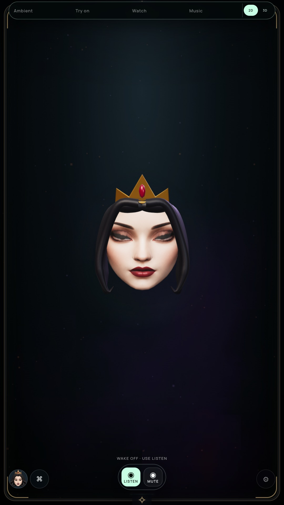
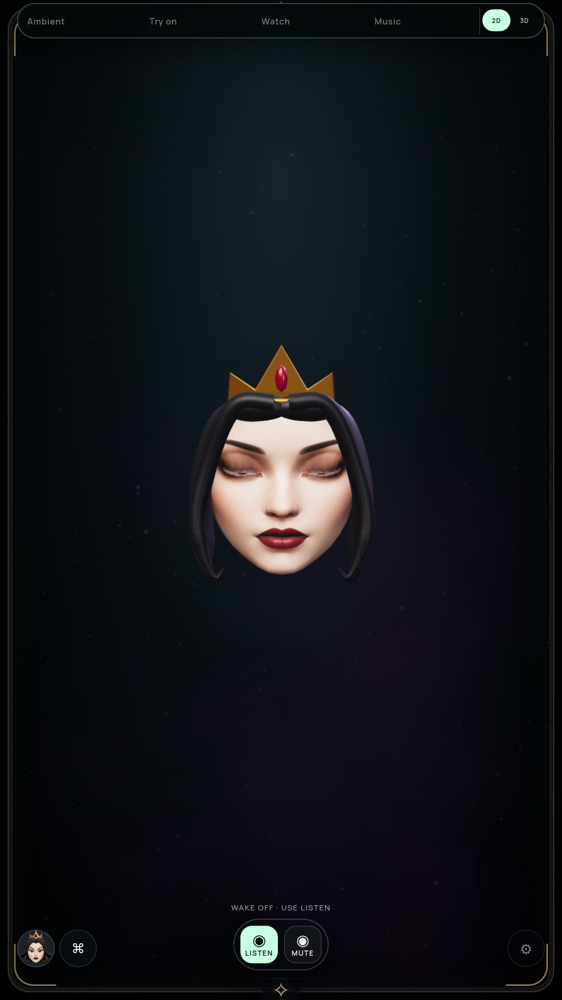

# Eyelid texture mapping

Status: visual improvement in the optional 3D preview; G2 remains open.

The upper eyelid now samples adjacent portrait skin as it closes, with independent
left/right controls and continuous interpolation for blink/squint. The adjoining
skin row moves with that sampling patch so the texture keeps area. Corners, lower
lash edge, eyebrows, mouth and face silhouette are retained. Neutral restores the
exact source UVs. The original portrait image is unchanged.

An initial attempt moved the edge all the way to its adjacent skin row. It removed
the dark band but collapsed texture area, creating vertical streaks. Limiting the
shift alone still left streaks. The final version also carries the adjacent row,
which removes the conspicuous stripes in the reviewed front and turned closures.
The closed lids still show strong makeup shading; this is a stylized improvement,
not authored eyelid anatomy or a passed realism gate.

| Previous closed blink | Revised closed blink |
| --- | --- |
|  |  |

[Rendered four-second motion preview](media/queen-lid-texture-motion.mp4).
The movie is an offline frame sequence encoded at 24 fps; it does not measure
live throughput, audio synchronization or tracked blinks.

## Verification and resource bounds

- Full unit suite passed on final source. Both actual GLBs exercise independent
  partial/full closure, untouched face regions, exact neutral restoration and
  no repeated settled UV uploads. No cumulative edits are made to coordinates.
- Packaged NVIDIA and software audits exercise 20 expressions/poses, both personas,
  actual live closed-edge convergence and UV changes, exact UV restoration on
  reopening, zero settled repaints, quality limits and placement anchors.
- Mapping changes at most 28 existing UV vertices; it adds no geometry, textures,
  shader sampling passes or draw calls. The existing small UV buffer uploads only
  when its mapping changes. Actual workload performance still needs qualification.
- A neutral threshold handles asymptotic expression smoothing, preventing a tiny
  residual UV offset after reopening.

Archive: `4452f1bc039351fe360a773583ee32e8c01d52a879a77521d5e76ab5cedcc9f1`. Reports: [NVIDIA](LID-TEXTURE-GPU-VERIFICATION.json), [software](LID-TEXTURE-SOFTWARE-VERIFICATION.json).

Snow's closed-eye capture retains a conspicuous light/dark band from the lower
lid texture. The Queen improves more than Snow. Lower-lid sampling and lash/crease
anatomy are the next defects; these structural passes do not mean either performer
is visually qualified. [Snow closure](media/queen-lid-texture-solenne-blink.jpg).
The existing running monitors retain older immutable builds; they do not qualify
this change. Physical sensors, Windows and TV-distance visual quality remain open.
