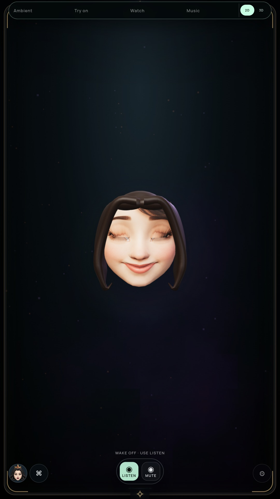
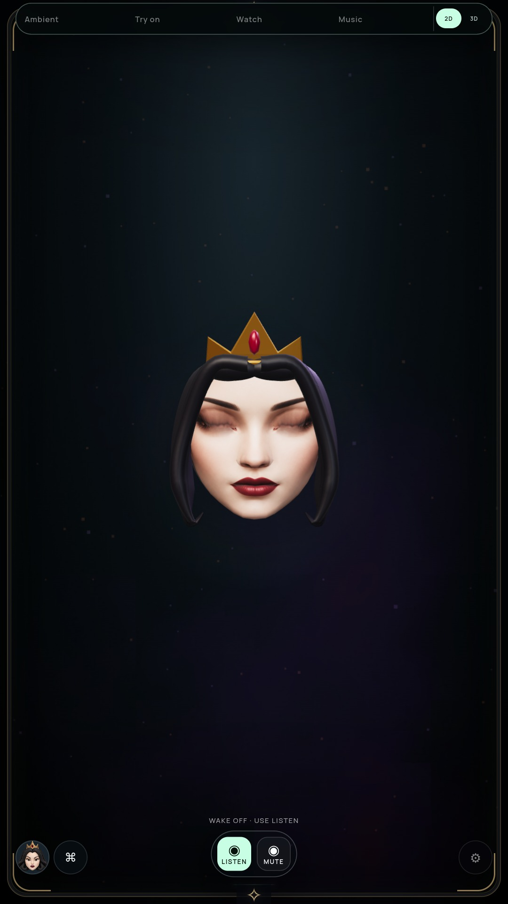

# Lower-lid texture sampling

Status: optional 3D preview improved; full-suite goal and G2 remain open.

## Change and review

The lower eyelid now moves its texture sampling toward nearby skin during closure,
alongside the existing upper-lid mapping. Source coordinates restore exactly when
the eye reopens. Left and right remain independent; there is no eye hiding or new
overlay surface. The original portraits remain unchanged.

The first lower-row mapping removes the Queen's pale lash strip but leaves Snow's
dark patch. Both actual Snow blink weights reach 1. Inspection of the original
embedded texture reveals that the first detected lower skin row still samples the
painted large eye. The final mapping uses eye height to extend that sampling reach,
bounded between 1× and 4× the local skin-row distance. It clears the conspicuous
dark pupil-like patch in Snow's reviewed closure. A faint rectangular tint remains
under the lashes; that is still a visual defect, not a fully qualified blink.

| Previous Snow closure | New closure |
| --- | --- |
|  |  |

[Queen motion preview](media/lower-lid-motion.mp4): offline actual rendered frame
sequence encoded at 24 fps, not a live throughput or audio synchronization measure.

## Verification

- Full `npm test` passed.
- Both actual GLBs test partial lower-row shifts, independent left/right control,
  untouched corners/face regions, exact neutral restoration and settled reuse.
- Actual packaged NVIDIA and software audits passed 20 poses plus Snow's closed
  and partial closure captures, live upper/lower UV changes and exact restoration,
  actual closed geometry, no settled repaint, persona switching, persistence,
  quality bounds, eye gaze and five placement anchors.
- Archive: `24e72584f6c961f5bd11674a44f1bbc2e882f0a1ff9e756855e77f29e934f479`.
- [NVIDIA report](LOWER-LID-GPU-VERIFICATION.json),
  [software report](LOWER-LID-SOFTWARE-VERIFICATION.json).

The change writes at most 56 existing UV vertices when the mapping changes, with
no added geometry, texture, shader pass or draw calls. This is a resource bound,
not a measured speedup or physical PC-stick qualification. Existing monitors use
older immutable builds, camera/cloud/media off; this build has no completed soak.

Crease/lash anatomy, Snow's remaining tint, uninterrupted live speech and acting,
hair/crown refinement and final TV/Windows validation remain open. Keep the
portrait performer as default until the full visual and performance gates pass.
