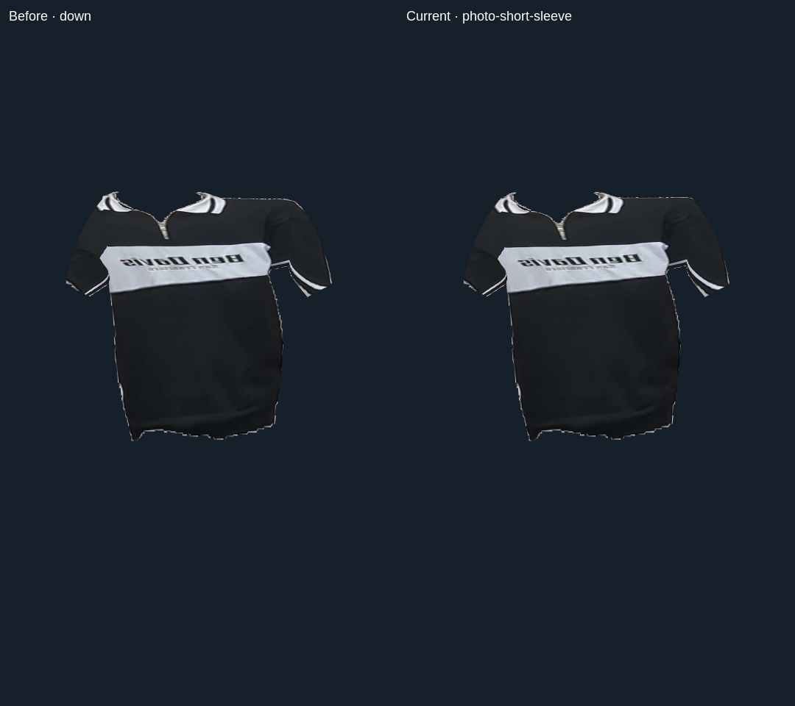
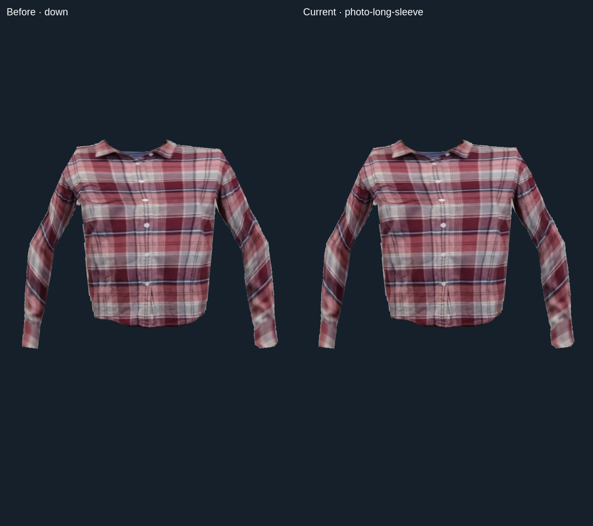

# Photographed shoulder anchors

The torso/sleeve mesh used one averaged texture height for both shoulder roots. Real front photos already have unequal heights, and a tilted photo increases that difference. Each shoulder now samples its original source height, with the correction fading toward the top and underarm. The center neckline and lower fabric retain their texture coordinates; body/sleeve seams use the same anchors.

This changes texture mapping only. The matched comparisons assert identical XYZ vertices, triangle counts and foreground limb ownership against frozen source `941bd00`. No new geometry, model, texture, pixel pass or draw loop is added.

## Verification

A unit regression fails on the previous source and passes after the change. Actual Electron canvas comparisons cover the real short and long shirt in down, raised, crossed, leaning and partial poses, plus the short shirt rotated +3° and −3° equally for both variants: 20 cases total. The previous maximum root-coordinate error is about 0.00617 / 0.00879 normalized UV units on original short/long photographs, and 0.01809 on the +3° short photo. Final source anchors match exactly in all cases. These are texture-coordinate errors, not physical sizing errors.

Full tests, package/source equality and actual offline-worker motion/body-loss/camera-off cleanup regression pass. [Exact archive, hashes and reports](PHOTO-SHOULDER-ANCHORS-VERIFICATION.json).

The reviewed change is subtle: source attachment improves, but flat fabric, sleeve caps, side coverage and drape remain approximate. A long-shirt photo rotated +3° is rejected by silhouette inference; that failed attempt is excluded from passing coverage. Straightening/rotation during intake is a useful next task. Originals should stay intact and per-side drafts should remain independently editable.

Physical input/Windows/realistic garment and power gates remain open. The existing NVIDIA soak runs source `48888e5`, separately from this change.
