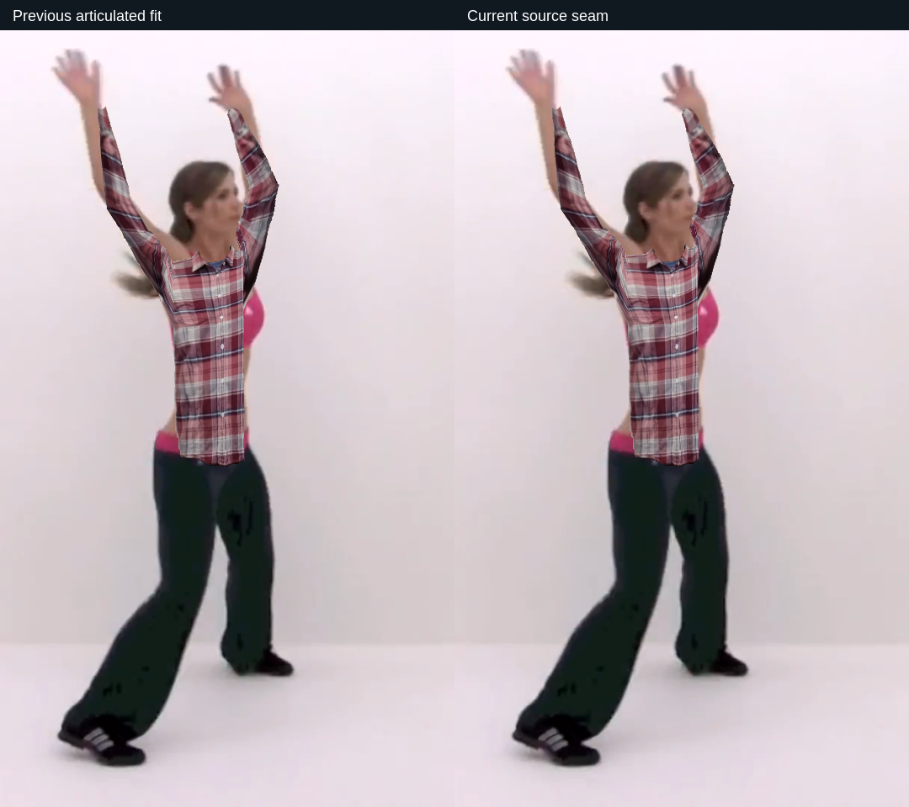

# Photo garment shoulders follow raised arms

G3 and the full suite remain open.

## Change

Photo sleeves already followed elbows/wrists, but their torso roots used the same shoulder lift whether arms were down or raised. Each valid upper arm now supplies a bounded rise measured against the projected torso axis. The corresponding outer shoulder receives at most another 4.5% of projected torso length; the effect tapers through the upper panel and reaches zero at the hem and center neckline. Opposite shoulders remain independent. Missing/degenerate upper arms contribute zero.

The sleeve still uses the torso's exact root vertices. No mesh triangles, source pixels, worker, timer or occlusion ownership are added or changed. This is an estimated display deformation, not cloth physics or physical size measurement.

## Evidence and visual review

- Full `npm test` passes. New units cover one raised arm, opposite shoulder/center stability, bounded displacement, ±0.4-radian lean, shared roots and unchanged mesh count. Existing tests retain wrist binding, missing-arm recovery, hem allowance and width profiles.
- Ten actual canvas short/long photo cases use baseline `7c95b36` with identical synthetic down/raised/crossed/lean/partial poses. Shared UV/XYZ seams, finite vertices, triangle counts and limb ownership pass. [Pose report](RAISED-SHOULDERS-POSE.json).
- Four original frozen camera/pose/world/mask cases retain three visible fits and one lost-body state. These mostly have arms down: regression evidence, not raised-arm improvement. [Original-input report](RAISED-SHOULDERS-FROZEN.json).
- Actual local tracking on the recorded camera produces six additional saved camera/pose inputs. Five fits remain visible and the sixth clears. The raised-arm case at six seconds was inspected: modest additional shoulder coverage, with side coverage and stretched fabric still visibly imperfect. Every visible mesh retains 448 triangles, exact projected wrist centers and original foreground-limb ownership. [Same-input comparison report](RAISED-SHOULDERS-REAL-REPLAY.json).
- Recorded long-photo worker run: 459/509 tracked display ticks visible, body loss/camera-off clear, maximum sampled heartbeat gap 167 ms. This shared-host screenshot workload is not display FPS or physical capture latency. [Motion report](RAISED-SHOULDERS-MOTION.json).
- Exact packaged archive `5f7d044da5ee834ceb3e739732ece30999adbfe3433fd5c6d063004da1a42904`: 65-second recorded camera/AR/optional rig/synthetic PCM with Natural enhancement, 17 samples, zero recorded errors; mirror/camera-off/sleep/restart covered. [Lifecycle](RAISED-SHOULDERS-LIFECYCLE.json). [Source/test hashes](RAISED-SHOULDERS-BUILD.json).

[Synthetic raised photo](media/raised-shoulders-photo.png), [down-arm regression](media/raised-shoulders-down.png).

The first motion command used the wrong output-label variable and exercised the short garment. Its results were saved separately; the original frozen inputs were copied and hash-verified before output replacement, then restored exactly. The accepted long run uses `MIRROR_MOTION_GARMENT=long MIRROR_MOTION_LABEL=raised-shoulders-long-motion`. No claim is based on mislabeling that first run as long-photo evidence.

Reproduce: `npm test`; `MIRROR_PHOTO_BASELINE=7c95b36 xvfb-run -a node_modules/.bin/electron --no-sandbox tools/check-photo-shoulders.cjs`; then the long motion command above. For its exact comparison: `MIRROR_TORSO_BASELINE=7c95b36 MIRROR_REPLAY_ROOT=artifacts/raised-shoulders-long-motion MIRROR_REPLAY_SECONDS=1,3,6,8,12,18 MIRROR_REPLAY_LABEL=raised-shoulders-real-comparison xvfb-run -a node_modules/.bin/electron --no-sandbox tools/check-torso-coverage-replay.cjs`.

## Still open

Flat texture stretching, shoulder/armhole anatomy, side/back coverage and realistic drape remain unfinished. The rise relies on tracking quality and is not a measured physical fit. Voice/gesture routing is unchanged and covered by existing tests, not newly qualified with physical inputs. Windows/TV/audio/accounts and all master completion gates remain open.
