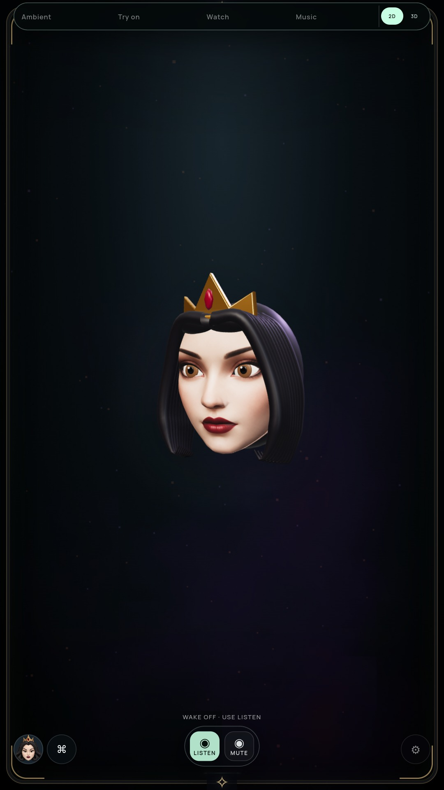

# Queen head surface continuity

Full-suite goal remains active. The 3D performer remains an optional preview.

## Change and visual review

The face and posterior head previously had matching boundary positions and normals
but different materials: a portrait texture versus a constant skin tint. The head
now shares the face material, UVs and vertex colors at the boundary. Boundary
samples extend over the rear volume; hair covers most of that surface. This removes
the conspicuous pale stripe below the cheek in the reviewed ±32° poses without
changing topology or adding draw calls. Shared materials, textures and geometries
now dispose once per tree.

| Before, same packaged pose | After |
| --- | --- |
|  |  |

[Four-second motion preview](media/queen-surface-motion-preview.mp4) combines gaze,
turn, blink and jaw motion. It is an offline sequence of actual rendered frames
encoded at 24 fps, **not** evidence of live rendering throughput or audio timing.

## Evidence

- Full `npm test` passed on final source.
- Actual packaged NVIDIA GB10 physical-lighting/MSAA and software Phong/FXAA
  audits passed: neutral, closed blink, independent brow, AA/O/EE/MBP/FV poses,
  smile, ±32° turns, gaze, both personas, quality limits, no settled repaint,
  persisted rig selection and face/glow alignment across five placements.
- Geometry checks use both actual GLBs' UV/color buffers and assert identical
  appearance attributes and morph positions/normals at the joined boundary.
- Cleanup test asserts one disposal per shared material, geometry and texture.
- Final archive: `550a60a793fe54821ae89cb608b0c755def682115cd5f8eebc8737794c8d145f`.
- Before archive: `8df1e89f8925a3d0dfbf3bbaa2d481836e98f770b4abde2049d5a3647bbc8de5`.
- Reports: [NVIDIA](RIG-SURFACE-GPU-VERIFICATION.json),
  [software](RIG-SURFACE-SOFTWARE-VERIFICATION.json).

The first after-change NVIDIA audit failed because its fixed 600 ms persona delay
checked the old persona before asynchronous loading finished. The audit now waits
for ready state and the requested persona, with its existing bounded timeout;
both final backend runs passed. This does not establish a persona-switch latency
target. No microphone, provider conversation or physical TV was exercised.

## Remaining visual defects

Closed blink still has an unnatural dark slit, partly from the textured eye region
and surrounding geometry. Hair has visible procedural grooves/tips, and the crown
is simple. The rear surface extends boundary appearance rather than reconstructing
real anatomy or new skin detail. Posed MBP/FV do not establish live consonant
recognition. Those limitations keep the avatar visual gate open.
