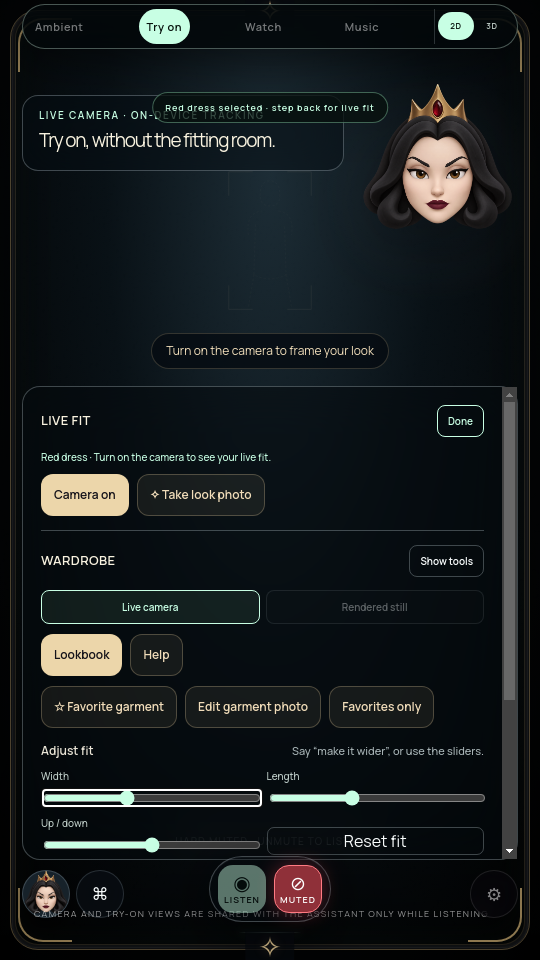

# Persistent local garment selection

The main Live Fit summary retains the selected garment name alongside camera and tracking guidance, including camera off and unusable-photo warnings. Switching local/live AI/still views uses the same local summary; existing loading and fitted messages avoid duplicating the name. No polling or animation loop was added.

## Verification

The packaged renderer matches source. Syntax checks, the complete packaged wardrobe journey, and the four-viewport general UI audit passed. Wardrobe assertions cover Red / Blue / Red selection with camera off, retained image warnings after track release, and return to a supported starter. The journey also covers eight saved garments, original retention, front/back persistence, photo intake and voice/interpreted gesture routing. [Exact build and evidence](SELECTION-SUMMARY-VERIFICATION.json).

An initial run could not launch without DISPLAY; reruns use Xvfb. The first camera-photo expectation was incorrect: that synthetic fixture has no usable cutout, so its photo guidance must remain. Corrected assertions preserve the warning rather than requiring a camera-only message. These failed attempts are not passing evidence.

No physical sensor, account, Windows, fabric realism or TV-distance qualification is claimed. All acceptance gates remain open.
