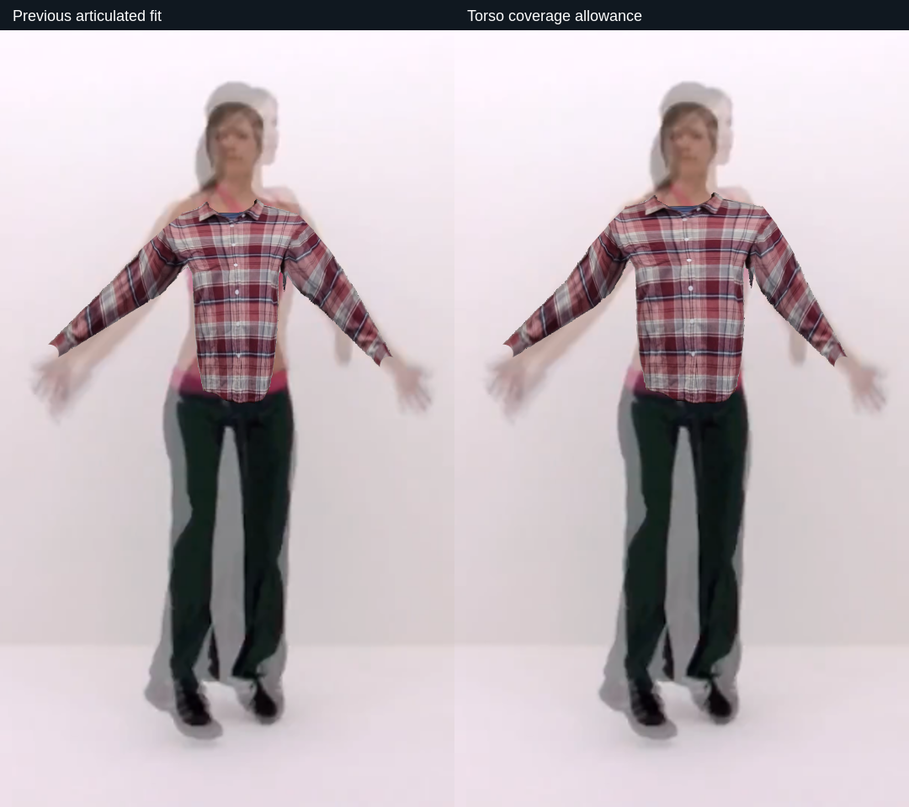
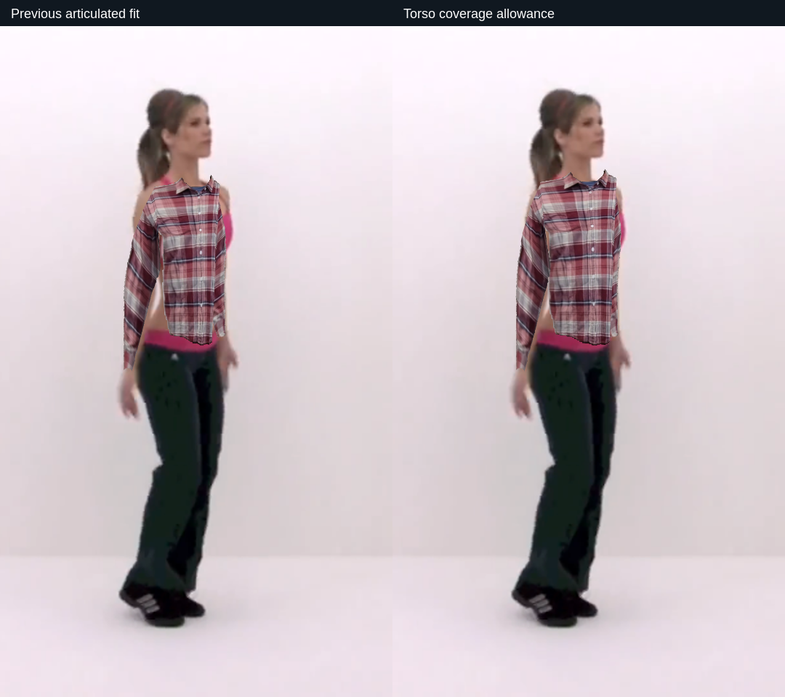
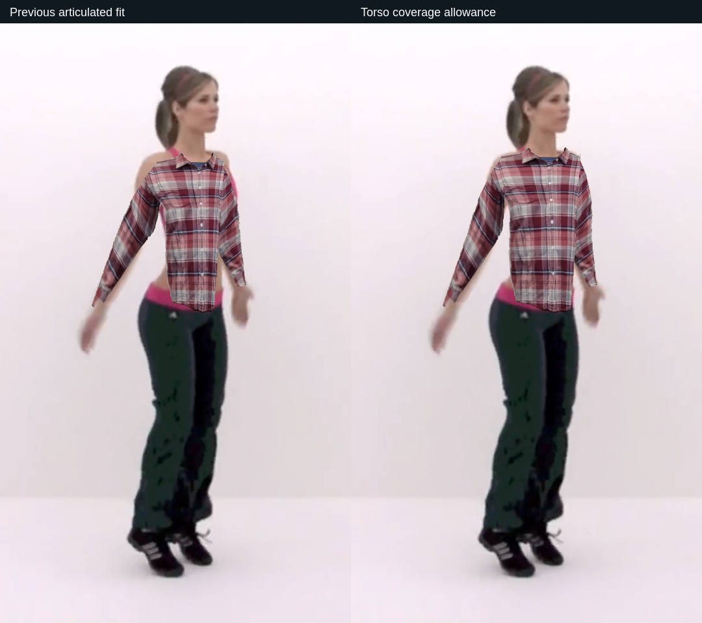

# Personal garment torso coverage — October 9, 2026

Full suite status: incomplete. This advances G3; it does not pass the garment realism gate.

## Finding and change

The matched long-shirt images exposed shoulders and narrow torso coverage. Photo geometry used the shoulder and hip joint centers as outer seams. These landmarks are inside the visible body, so a source cutout drawn between them can look too narrow even with correct wrist cuffs.

`src/photoSleeves.js` now applies a bounded visual allowance along the existing shoulder/hip axis: 20% extra transverse span at the shoulder, smoothly increasing to 36% at the hip, plus a shoulder lift of 3.5% of projected torso length tapering to zero at the hip. User width/length controls still apply. Allowance follows leaning rather than expanding only in screen X, and preserves the curved panel and shared sleeve roots. It estimates display coverage, not the wearer's physical size or hidden cloth. No segmentation-derived body width or extra mesh triangles were added.

## Evidence

- `npm test` and `npm run pack`: exit 0. Final archive `a5f85a141a50915d42761a5a5c8caa1d93ae78a12f849ce089c3f98778bf6c67`. Extracted packaged `src/photoSleeves.js` exactly matches the tested source.
- `tools/check-torso-coverage-replay.cjs`: compares against frozen Git source `8710cd2`, using the same four stored camera/pose/world/mask/fit inputs. Three usable poses retain 448 triangles, the same foreground-arm coverage and wrist bindings; the fourth clears in both versions. Baseline source and input hashes are saved. Existing source contour/normal dependencies are unchanged.
- Actual canvas comparisons below were inspected. Frontal, profile and turned shoulder/torso coverage improve, while exposed original clothes, flat projection and imperfect underarms remain visible. Three selected visible cases do not qualify every garment or motion.
- Photo unit tests retain finite short/long geometry, shared UV/XYZ roots, exact default wrist binding and missing-arm recovery. Added frontal and ±0.4-radian torso lean checks verify transverse hem allowance and torso-only behavior.
- Actual offline-worker recorded-motion check: 554/605 tracking display ticks visible (91.6%); body-loss and camera-off clear passed. Maximum sampled heartbeat gap 110.1 ms. Screenshot sampling/shared host affect timing; this is neither physical-camera latency nor display FPS.
- Actual packaged upload/cutout/native save preserves exact original bytes, wardrobe voice callback selects the long photo, and synthetic camera transport plus explicit pose fixtures exercise full/one-wrist/two-wrist recovery and camera shutdown. No acoustic voice or physical tracking claim.

[Structured verification](TORSO-COVERAGE-VERIFICATION.json) contains the exact tested archive, source/input hashes, command outcomes and scope. Reproduction: `xvfb-run -a node_modules/.bin/electron --no-sandbox tools/check-torso-coverage-replay.cjs`; it requires the existing frozen `artifacts/photo-fit-motion` inputs and author garment fixture. Those local research files are not bundled into the application.

## Remaining work

Flat fabric, exposed areas and shoulder/underarm silhouette still prevent convincing drape. The allowance is a bounded default; it does not solve open/cropped/loose garment parsing or sewn side/back continuity. Continue broader garment/motion review alongside combined camera/voice/avatar/media measurements. The existing immutable camera-off monitors remain separate, on earlier archives. Final physical Windows/TV/sensor/account checks are open.
