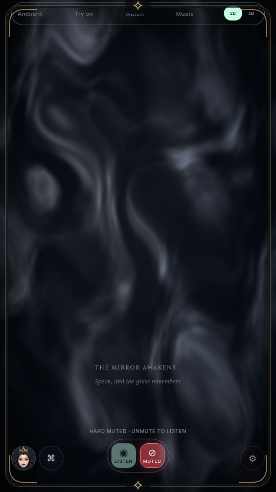
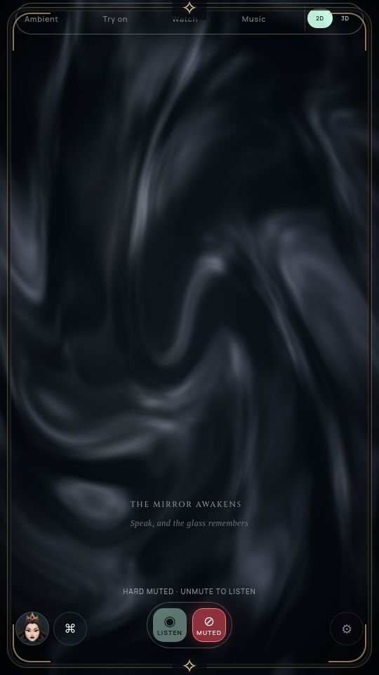
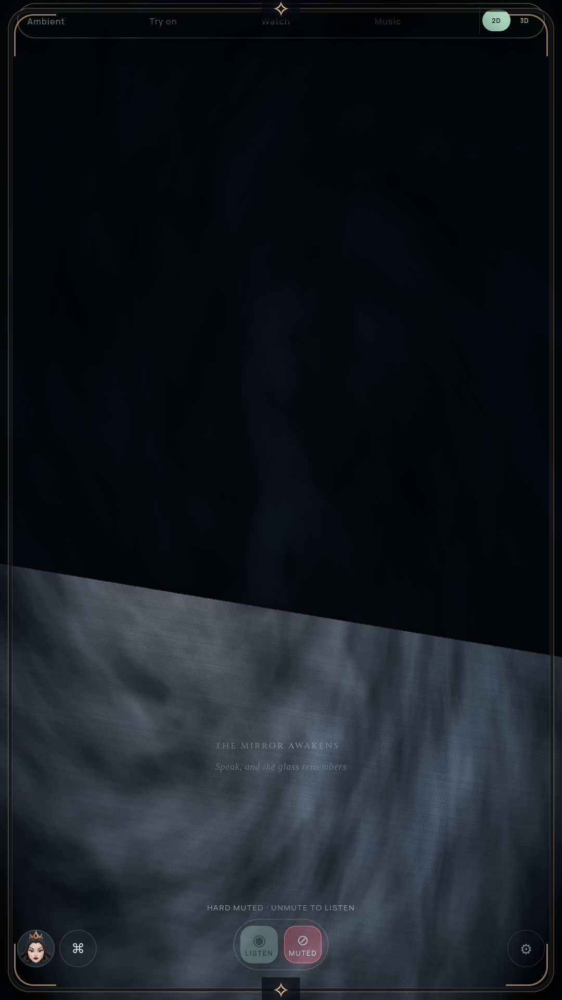
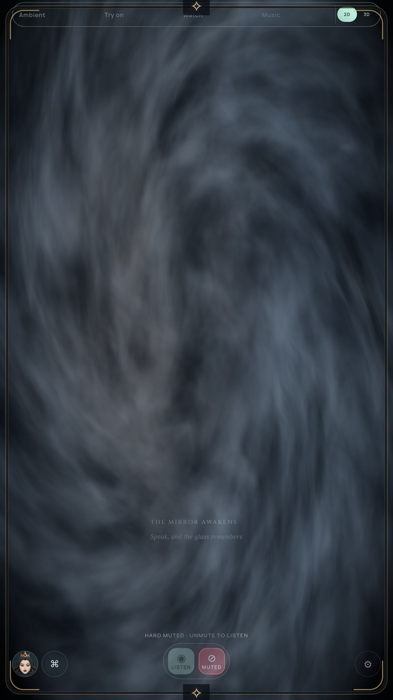

# Curved wake flow and native fog repair — 2026-10-09

The local wake field now has differential angular flow: inner wisps turn faster than outer ones and continue into the arrival clearing. Rational rotation keeps radial distance and avoids per-pixel trigonometry in the CPU fallback. It retains the bounded 3-second wake / 1.1-second arrival cues and existing noise field. The CPU wake-end and arrival-start images match exactly in the production-function test; the sequence starts and ends transparent.

| Previous CPU flow | New CPU flow |
| --- | --- |
|  |  |

## Native visual failure found and repaired

The first native capture passed the old lifecycle assertions but visibly had a hard diagonal cut. A direct GPU probe found correct opacity with black color in the upper image, while a solid-color probe confirmed full triangle coverage. The large-coordinate sine dither aligned with the failure boundary. Dither now samples bounded values from the existing noise texture.

The packaged pre-fix archive `9d6a0d1cd153ce8cde501021cc6c917e42af6c1a678938f3426957698e97bd15` fails the added native pixel check: 11 of 15 visible samples have black color. The final actual NVIDIA package has 15 visible samples, zero black samples and no GL error. The initial green animation reports are rejected as proof of visual correctness.

| Native defect | Final native field |
| --- | --- |
|  |  |

## Evidence and scope

Final archive `c2629732a0308e8e3f4c3cdbc266e2b73a4ed64e7555d6f5ad974fa36a45eb9c`; embedded fog sources match the current source. [Native/CPU results, interruption checks, pixel samples, source hashes and isolated cost](WAKE-FLOW-VERIFICATION.json).

- Packaged CPU and actual NVIDIA captures pass visible reveal, reduced-motion no-frame behavior and Chromium mouse-click Stop/hard-mute cancellation during a live cue. Frame counts remain unchanged after cancellation. Full tests pass. An initial unit harness omitted exposing its VM fog class; corrected before final passing runs.
- [Timed CPU capture](media/wake-flow-live-cpu.mp4), [timed native capture](media/wake-flow-live-native.mp4), [smooth native export](media/wake-flow-export-native.mp4). Timed screenshots target 12 fps and record readback timing; the posed export advances production fog at 60 Hz. Neither establishes physical display FPS or acoustic wake timing. Tests explicitly trigger the local cue and remain silent/provider-free.
- Isolated Node 240×360 CPU field median: approximately 4.41 → 5.56 ms on this shared host, with mocked upload. This is added short-cue work, not a power saving, browser benchmark or PC-stick qualification. GPU flow uses arithmetic and reuses one existing noise lookup for dither; no new surface, texture, worker or persistent loop.

Reproduce after packing: `MIRROR_MAGIC_LABEL=wake-check xvfb-run -a node tools/check-magic-animation.cjs`. For native: add `MIRROR_MAGIC_BACKEND=vulkan MIRROR_PREVIEW_HD_GPU=true`; the check requires actual NVIDIA output. Standalone diagnostic: `xvfb-run -a node_modules/.bin/electron --no-sandbox --use-gl=angle --use-angle=vulkan --use-cmd-decoder=passthrough tools/probe-fog-native.cjs`.

The cinematic experience still needs broader viewing and natural voice review; control/caption contrast over dense fog merits further work. Physical TV/Windows, microphone/voice greeting timing, power and all G1–G8 gates remain open. The camera/AR monitor freezes older source `f9a1291` and does not qualify this wake change.
