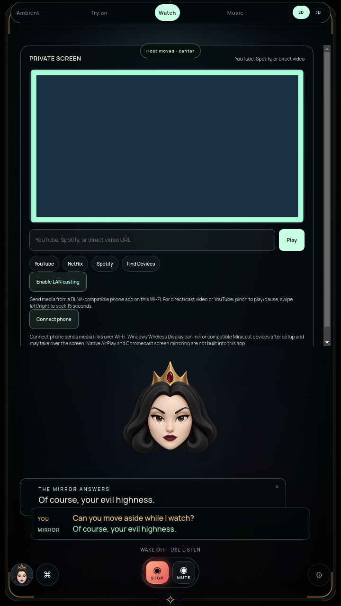
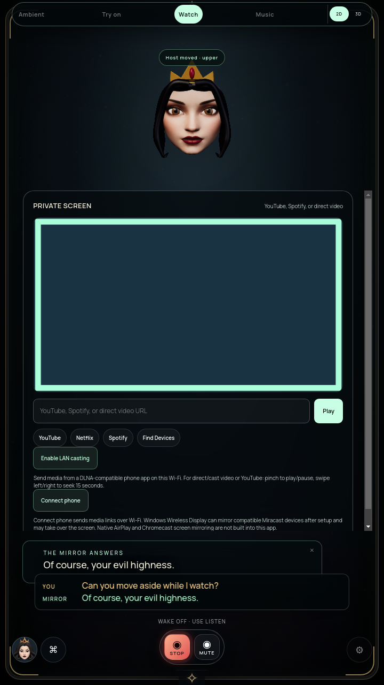
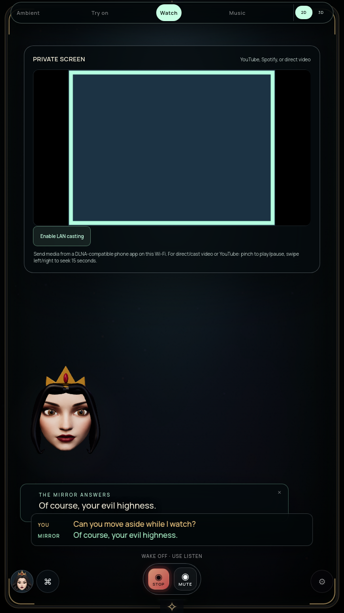

# Watch avatar and media framing — October 9, 2026

Full suite incomplete. This improves Watch layout and revalidates media behavior on Linux; it does not pass overall avatar realism, animation, physical TV or Windows gates.

## Reproduced defect

The prior portrait Watch screenshot placed the compact avatar in the top-right region covered by the media card. The original fixed inset could leave only a fragment of the face visible. The responsive media box could also crop the native video/control area. Expanding the first landscape-only audit to portrait media exposed intrinsic-height overflow even after an initial fit correction.

## Change

`WatchAvatarLayout` reserves separate content and companion bands measured from the actual portrait shell, header and visible captions/response/dock controls. Center/left/right/lower use a lower band; upper reserves a band above the content. Watch controls scroll within the remaining area, including an expanded pairing card. Stop releases the reservation and hides the Watch avatar; Portal and native desktop retain their own layouts. Resize/DOM observers coalesce updates into one pending animation-frame callback; there is no layout polling loop. Reduced motion removes avatar inset animation.

The native video and iframe are anchored inside a 16:9 display, with complete source imagery fitted using `object-fit: contain`. Portrait and 4:3 sources letterbox without clipping. The display remains bounded and native media controls fit inside it. This does not implement phone screen mirroring or full-screen portrait casting.

## Final verification

Archive `aae19e8fd86db24ca7b3eb79ba9b32399006b856b6f60064fae57abec0cdee6f`. Extracted HTML, renderer and new layout module match tested source byte-for-byte. Source hashes and results are in [structured verification](WATCH-AVATAR-LAYOUT-VERIFICATION.json). Full `npm test` and `npm run pack` exit 0.

- Actual packaged app: 40 settled cases, combining portrait/rig performers; center/left/right/upper/lower position callbacks; 540×960, 720×1280, 1080×1920 and 1280×720 windows (the wide window uses the portrait matte).
- Host bounds do not overlap the clipped visible Watch stage, captions or response card, and remain inside the shell. Offscreen scroll content is intentionally excluded from visible obstruction checks. Two caption rows remain visible.
- Portrait and 4:3 media dimensions pass the native-video-inside-display check. Compact cast presentation retains the companion area.
- The actual native phone-link flow generates its QR. The small-window scroll test reaches Stop phone link; no physical phone scan was performed.
- Stop clears the Watch reservation and hides its performer; Portal restores its performer/layout. No constant observer polling was introduced.
- The same exact package repeats decoded synthetic audio/video, local speech PCM, native SOAP volume/mute intent, Stop/mute restoration and paused-state preservation. Actual public YouTube playback continues during speech/Stop, and paused YouTube remains paused. YouTube/native Spotify ducking remain unsupported.

The initial intrinsic-height failure is retained. It was fixed in production CSS, not by relaxing the media-bounds assertion. Tests compare settled geometry after 650 ms; these stills do not qualify continuous transition trajectories, facial realism, physical display FPS, speaker/microphone behavior or TV-distance legibility. The face still needs the art/anatomy and speech work in G2.

## Reproduce / continue

`xvfb-run -a node tools/check-watch-avatar-layout.cjs` uses an immutable copied package, temporary profile, synthetic live video and transcript/position callbacks. `MIRROR_WATCH_AUDIO_YOUTUBE=true xvfb-run -a node tools/check-watch-audio.cjs` repeats media/voice behavior including a public YouTube check.

Next: diagnose recorded-camera ghosting against decoded source imagery, simplify live try-on control obstruction and review continuous Watch repositioning. Continue YouTube/native Spotify volume support, facial anatomy/consonants and combined/release qualification. Physical Windows/TV/sensor/account/phone gates remain open. Prior immutable monitors are separate builds, not validation of this newer layout archive.
